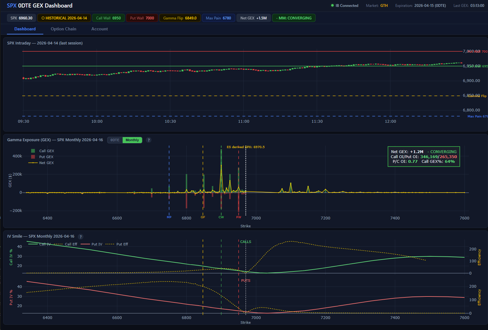
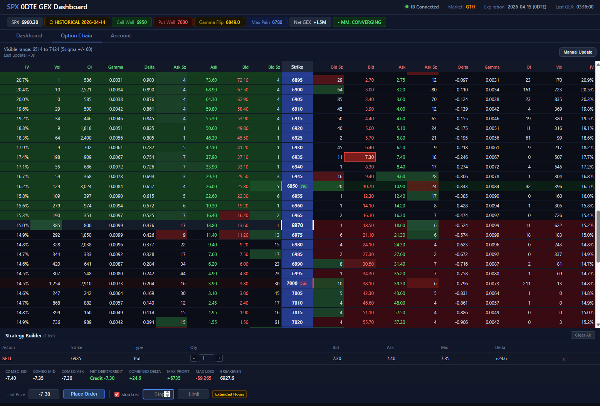
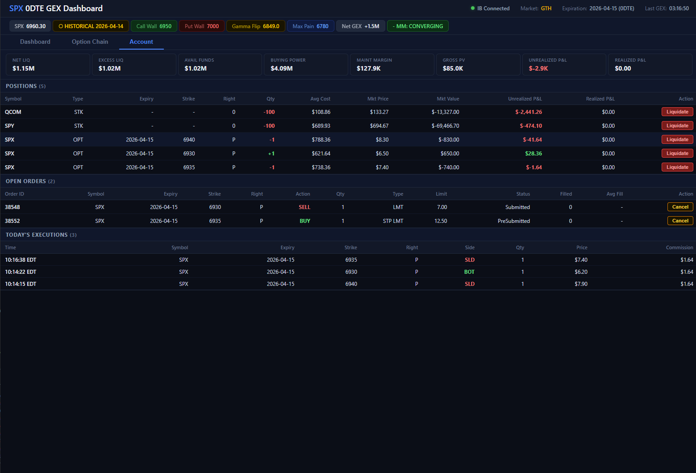

# SPX 0DTE Option Dashboard

A real-time Gamma Exposure (GEX) dashboard for SPX 0DTE options, powered by Interactive Brokers TWS and served as a browser app.

## Stack

| Layer | Technology |
|---|---|
| Broker API | `ib_insync` → IB TWS (port 7497) |
| Backend | Python 3.10, FastAPI, uvicorn |
| Real-time push | WebSocket broadcast |
| Frontend | Vanilla JS + Plotly 2.32 |

## Quick Start

1. Open IB TWS / Gateway and enable API access on port 7497.
2. Install dependencies:
   ```
   pip install -r requirements.txt
   ```
3. Start the server:
   ```
   python server.py
   ```
4. Open `http://localhost:8000` in a browser.

## Network Access

The server binds to all network interfaces (`0.0.0.0`), so it's accessible from both localhost and your local IP address:

- **Localhost only**: `http://localhost:8000`
- **Local network**: `http://<your-local-ip>:8000`

The exact URLs are printed to the console when the server starts. You can override the listening address with the `SERVER_HOST` environment variable if needed.

##NEW
- **Choice of 0DTE and Monthly SPX option** on **GEX** dashboard
- **Support on Stop Limit order placement**
- **Account/Order Management page**

## Screenshot





The dashboard displays three interactive charts:

### 1. SPX Intraday (top)
Candlestick chart with key GEX levels overlaid:
- Call Wall, Put Wall, Gamma Flip, Max Pain

### 2. Gamma Exposure (GEX) by Strike (middle)
Bar chart showing Call GEX (green) and Put GEX (red) by strike with:
- **Net GEX line** (yellow) — cumulative gamma exposure
- **Spot price indicator** (white dotted line)
- **Key level markers** — visual anchors for walls and flip points
- **Annotation box** — Net GEX value, MM regime (CONVERGING/DIVERGING), Call OI, Put OI, P/C OI Ratio, Call GEX % skew

### 3. IV Smile & Delta-Decay Efficiency (bottom)
Two-row subplot showing:
- **Top (Calls):** Call IV curve (green) + Call efficiency (yellow, dotted)
- **Bottom (Puts):** Put IV curve (red) + Put efficiency (yellow, dotted)
- All subplots share synchronized x-axes (strike ranges aligned)
- Hover displays: Strike, IV %, Delta, Charm (delta decay rate), Efficiency metric

**Real-time zoom sync:** Pan/zoom either the GEX or Smile chart → both charts update their x-axis range simultaneously.

### 4. Real-time Option Chain Streaming
- Livsestreaming 0 DTE option chain with greeks
- Markers on Put Wall, Call Wall, and Gamma Flip location

### Status Bar
Real-time status indicators:
- **IB Connection** — green dot when connected
- **Market Status** — RTH (green) / GTH (yellow) / closed (gray)
- **Expiration** — target SPXW expiration date
- **Last GEX Update** — timestamp of most recent chain fetch

### Level Badges
Key strike prices and conditions:
- **SPX** — current spot price
- **Call Wall / Put Wall** — highest gamma-OI strikes
- **Gamma Flip** — price level where net gamma crosses zero
- **Max Pain** — strike minimizing option holder payoff
- **Net GEX** — total gamma exposure (with regime label)
- **Data Mode** — LIVE, HISTORICAL, or ES-DERIVED

## Files

| File | Purpose |
|---|---|
| `server.py` | FastAPI app, IB connection, state management, WebSocket broadcast loops |
| `chain_fetcher.py` | Batched SPXW option chain fetcher (streaming mode, ±8σ strike filter) |
| `gex_calculator.py` | GEX computation: Call/Put Wall, Gamma Flip, Max Pain, Net GEX, MM regime |
| `market_hours.py` | Market-hours helpers, ET timezone, expiration utilities |
| `static/index.html` | Single-page dashboard (price chart + GEX bar chart, level badges) |

## Configuration (environment variables)

| Variable | Default | Description |
|---|---|---|
| `IB_HOST` | `127.0.0.1` | TWS host |
| `IB_PORT` | `7497` | TWS API port |
| `IB_CLIENT_ID` | `1` | IB client ID |
| `CHAIN_REFRESH_SECONDS` | `60` | How often to re-fetch the option chain |
| `SERVER_HOST` | `0.0.0.0` | Server listen address (all interfaces) |
| `SERVER_PORT` | `8000` | Server listen port |

## Data Modes

- **LIVE** — SPX streaming quote from IB during RTH (09:30–16:15 ET).
- **ES-DERIVED** — Off-hours SPX price inferred from ES front-month futures movement relative to the last SPX close.
- **HISTORICAL** — Last available historical bars when markets are closed and ES is unavailable.
