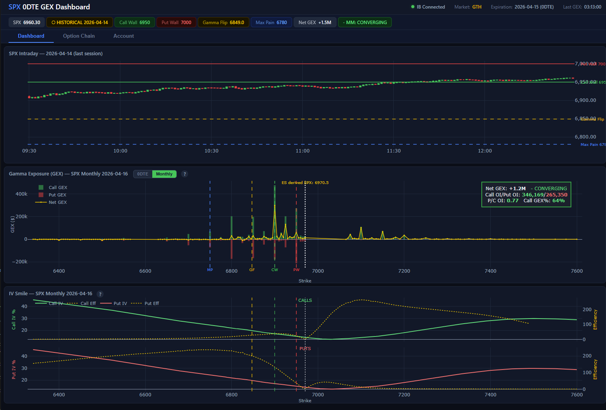
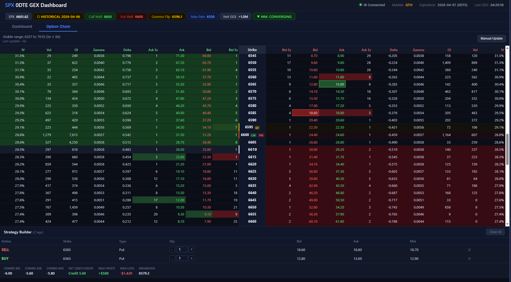
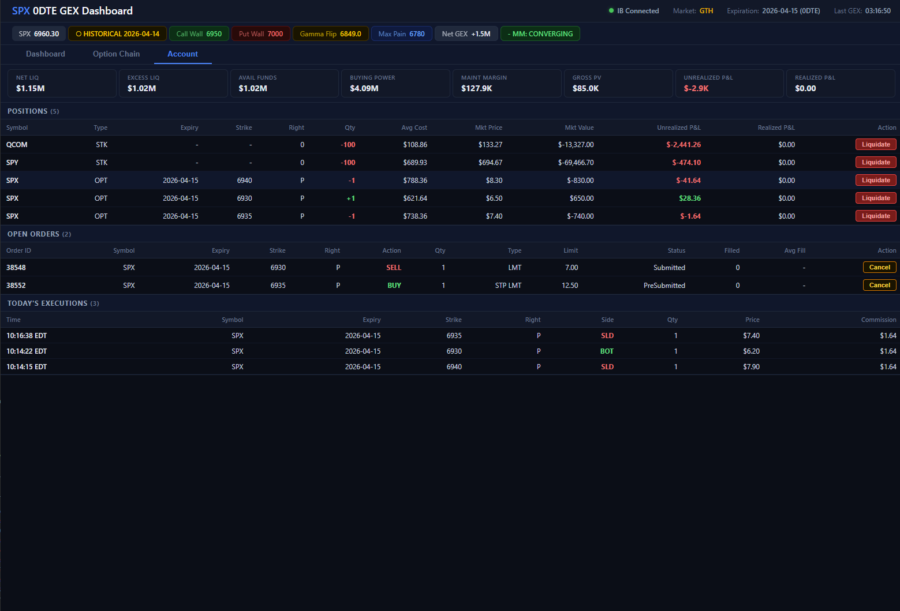

# SPX 0DTE Option Dashboard

A real-time Gamma Exposure (GEX) dashboard for SPX 0DTE options, powered by Interactive Brokers TWS and served as a browser app.

## Stack

| Layer | Technology |
|---|---|
| Broker API | native `ibapi` → IB TWS/Gateway (port 7497) |
| Backend | Python 3.10, FastAPI, uvicorn |
| Real-time push | WebSocket broadcast |
| Frontend | Vanilla JS + Plotly 2.32 |

## Features

- **GEX dashboard with 0DTE / Monthly toggle** — switch the GEX calculation between the current 0DTE SPXW expiry and the monthly SPX expiry.
- **Real-time option chain streaming** — live 0DTE chain with greeks, wall/flip markers, and a strike filter.
- **Account / Order Management tab** — account summary, portfolio positions, and order placement with **Stop Limit** support (also accessible as an order-entry widget on the dashboard).
- **Strategies tab** — define automated multi-leg strategies and let the server watch the market for you:
  - Conditions (entry window, short delta, spread width, credit, trend, volatility), triggers, and a candidate scanner.
  - **Budget-based position sizing** with total-credit preview per candidate.
  - Live candidates ranked best-first, each with a one-click **Place** button.
  - **Take-profit** (idempotent close loop, per-leg limit prices) and **stop-loss** as a single credit multiplier.
  - One-shot eval loop with re-entry guards, margin checks, and a kill switch.
  - **Subsequent strategies** — trigger children off a parent trade's state (parent close / time window), with acyclic tree validation.
- **Logging tab** — server-side framework log streamed to the browser.

## Quick Start

1. Open IB TWS / Gateway and enable API access on port 7497.
2. Install dependencies:
   - The native broker API client (`ibapi`), from your local TWS API source:
     ```
     pip install -e "C:\TWS API\source\pythonclient"
     ```
   - Python dependencies:
     ```
     pip install -r requirements.txt
     ```
3. Start the server:
   ```
   python server.py
   ```
4. Open `http://localhost:8000` in a browser.

### Tests

```
python tests/run_tests.py --pretty     # structured JSON results
pytest tests/ -v --tb=long             # standard pytest flow
```

## Network Access

The server binds to all network interfaces (`0.0.0.0`), so it's accessible from both localhost and your local IP address:

- **Localhost only**: `http://localhost:8000`
- **Local network**: `http://<your-local-ip>:8000`

The exact URLs are printed to the console when the server starts. You can override the listening address with the `SERVER_HOST` environment variable if needed.

## Screenshot





## Dashboard Tabs

- **Dashboard** — intraday chart, GEX bars, IV smile, level badges, status bar.
- **Option Chain** — full streaming chain table with greeks and order entry.
- **Account** — account summary, positions, executions, order placement.
- **Strategies** — strategy list/editor, live candidates, triggers, and arm/disarm controls.
- **Log** — real-time framework log.

## Charts

### 1. SPX Intraday (top)
Candlestick chart with key GEX levels overlaid:
- Call Wall, Put Wall, Gamma Flip, Max Pain

### 2. Gamma Exposure (GEX) by Strike (middle)
Bar chart showing Call GEX (green) and Put GEX (red) by strike with:
- **Net GEX line** (yellow) — cumulative gamma exposure
- **Spot price indicator** (white dotted line)
- **Key level markers** — visual anchors for walls and flip points
- **Annotation box** — Net GEX value, MM regime (CONVERGING/DIVERGING), Call OI, Put OI, P/C OI Ratio, Call GEX % skew

### 3. IV Smile & Delta-Decay Efficiency (bottom)
Two-row subplot showing:
- **Top (Calls):** Call IV curve (green) + Call efficiency (yellow, dotted)
- **Bottom (Puts):** Put IV curve (red) + Put efficiency (yellow, dotted)
- All subplots share synchronized x-axes (strike ranges aligned)
- Hover displays: Strike, IV %, Delta, Charm (delta decay rate), Efficiency metric

**Real-time zoom sync:** Pan/zoom either the GEX or Smile chart → both charts update their x-axis range simultaneously.

### 4. Real-time Option Chain Streaming
- Live streaming 0DTE option chain with greeks
- Markers on Put Wall, Call Wall, and Gamma Flip location

## Status Bar

Real-time status indicators:
- **IB Connection** — green dot when connected
- **Market Status** — RTH (green) / GTH (yellow) / closed (gray)
- **Expiration** — target SPXW expiration date
- **Last GEX Update** — timestamp of most recent chain fetch

## Level Badges

Key strike prices and conditions:
- **SPX** — current spot price
- **Call Wall / Put Wall** — highest gamma-OI strikes
- **Gamma Flip** — price level where net gamma crosses zero
- **Max Pain** — strike minimizing option holder payoff
- **Net GEX** — total gamma exposure (with regime label)
- **Data Mode** — LIVE, HISTORICAL, or ES-DERIVED

## Files

| File | Purpose |
|---|---|
| `server.py` | FastAPI app, IB connection, state management, WebSocket endpoint |
| `ws_handler.py` | WebSocket message routing (tabs, GEX mode, strategies, orders, viewport sync) |
| `ib_client.py` / `ib_connection.py` | Native `ibapi` wrapper: contract resolution, streaming quotes, connection lifecycle |
| `chain_fetcher.py` | Batched SPXW option chain fetcher (streaming mode, ±8σ strike filter) |
| `chain_manager.py` | Chain caching, qualification, streaming state, monthly/0DTE coordination |
| `gex_calculator.py` | GEX computation: Call/Put Wall, Gamma Flip, Max Pain, Net GEX, MM regime |
| `market_hours.py` | Market-hours helpers, ET timezone, expiration, FOMC/NFP day utilities |
| `price_bars.py` / `risk_free.py` | Historical bars and risk-free-rate (SGOV) helpers |
| `order_manager.py` | Order placement, take-profit close loop, stop-loss handling |
| `account_manager.py` | Account values, portfolio positions, executions serialization |
| `strategy_models.py` | Strategy/Condition/Trigger/TakeProfit/StopLoss/RuntimeState dataclasses |
| `strategy_engine.py` | Candidate generation, condition eval, sizing, entry payloads, triggers, parent/child logic |
| `strategy_store.py` | Strategy persistence to `config/strategies.json` |
| `app_state.py` | Shared AppState runtime, day key, kill switch |
| `log_buffer.py` | Ring-buffer framework log for the Log tab |
| `config.py` | Centralized settings: env var → `config/params.yaml` → defaults |
| `static/` | Browser app: `index.html`, `css/`, `js/` (charts, chain table, order entry, strategy UI, tabs, WS) |
| `tests/` | Pytest suite + `run_tests.py` structured runner |

## Configuration

Settings are resolved in order: **environment variable → `config/params.yaml` → hardcoded default**.

| Variable | Default | Description |
|---|---|---|
| `IB_HOST` | `127.0.0.1` | TWS host |
| `IB_PORT` | `7497` | TWS API port |
| `IB_CLIENT_ID` | `1` | IB client ID |
| `CHAIN_REFRESH_SECONDS` | `10` | How often to re-fetch the option chain |
| `DASHBOARD_CHAIN_REFRESH_SECONDS` | `300` | Dashboard GEX chain refresh cadence |
| `CHAIN_TAB_FULL_REFRESH_SECONDS` | `300` | Chain tab full refresh cadence |
| `SNAPSHOT_REFRESH_SECONDS` | `300` | Snapshot refresh cadence |
| `SERVER_HOST` | `0.0.0.0` | Server listen address (all interfaces) |
| `SERVER_PORT` | `8000` | Server listen port |
| `DEFAULT_ANNUAL_VOL` | `0.20` | Assumed annualized volatility for unlisted IV |
| `MONTHLY_CACHE_TTL` | `600` | Monthly chain cache TTL (seconds) |
| `SGOV_TICKER` | `SGOV` | Ticker used for risk-free rate |
| `DEFAULT_RISK_FREE_RATE` | `0.043` | Fallback risk-free rate |
| `RTH_OPEN` / `RTH_CLOSE` | `09:30` / `16:15` | Regular trading hours window (ET) |
| `FOMC_DATES` | `[]` | FOMC meeting dates (via `params.yaml`) |

Additional tunables (chain streaming, batch sizes, viewport sync, SPXW cease/gap windows) live in `config.py` and `config/params.yaml`.

## Discord Bot

Optional in-process bot that lets an allowlisted user query the dashboard and
control strategies from Discord. **Orders are never placed from Discord** —
the `/place` command shows the candidate and directs you to confirm in the web UI.

### Settings UI

Configure Discord — and the IB Gateway port — from the dashboard: click the
gear icon in the header. Apply hot-applies the change (the Discord bot restarts
in place; the IB port reconnects immediately) and persists it to the repo-root
`.env`, which overrides `config/params.yaml` but loses to real environment
variables. Settings endpoints only accept localhost connections. The header
connection badge is display-only now.

### Manual setup (headless alternative)

1. Create a bot in the Discord Developer Portal, copy its token, and add the
   `applications.commands` scope. Invite it to your server.
2. Provide the token and options via env var or `config/params.yaml` (never
   commit a real token):

| Variable | Example | Notes |
|---|---|---|
| `DISCORD_TOKEN` | `abc...` | Bot token. Presence enables the bot. |
| `DISCORD_GUILD_ID` | `123456789` | Optional; guild-local slash commands sync instantly. |
| `DISCORD_CHANNEL_ID` | `987654321` | Optional; alert-stream channel. |
| `DISCORD_ALLOWED_USER_IDS` | `111,222` | Allowed Discord user IDs. |
| `DISCORD_ALLOWED_ROLE` | `trader` | Optional role name or ID that is also allowed. |

3. Restart the server.

### Commands

`/status` `/account` `/positions` `/orders` `/strategy` `/candidates <name>`
`/arm <name>` `/disarm <name>` `/killswitch on|off` `/place <name> <index>`

- Read commands query live dashboard state.
- `/arm` warns when the strategy `auto_execute`s, and honors the global kill switch.
- `/place` intentionally refuses — place orders in the browser.
- A curated stream (fills, strategy exits, take-profit closes, IB errors,
  connection and kill-switch changes) is posted to `DISCORD_CHANNEL_ID`.

## Data Modes

- **LIVE** — SPX streaming quote from IB during RTH (09:30–16:15 ET).
- **ES-DERIVED** — Off-hours SPX price inferred from ES front-month futures movement relative to the last SPX close.
- **HISTORICAL** — Last available historical bars when markets are closed and ES is unavailable.
